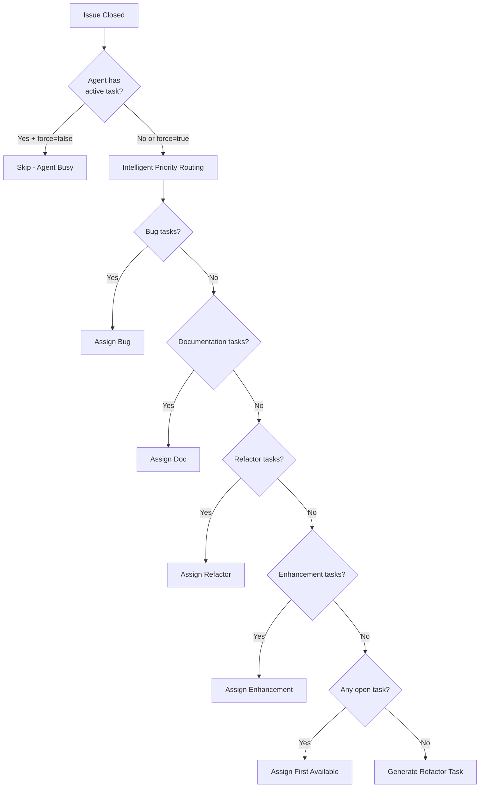

<div align="center">

# Auto Assign Copilot to Issues

[](https://github.com/mudman1986/auto-assign-copilot-action/releases)
[](https://github.com/mudman1986/auto-assign-copilot-action/actions)
[](https://opensource.org/licenses/MIT)

**Autonomous agent orchestration for GitHub Copilot - intelligent, priority-based issue assignment**

[Features](#features) • [Quick Start](#quick-start) • [Configuration](#configuration) • [Examples](#examples)

</div>

---

## Features

<table>
<tr>
<td width="33%" valign="top">

### Intelligent Assignment
- **Priority-based routing**: bug → documentation → refactor → enhancement
- **Adaptive fallback**: Autonomous selection from available issues
- **Grace period**: Configurable wait time for manual assignment (default: 5 minutes for issue events)

</td>
<td width="33%" valign="top">

### Autonomous Refactor Management
- **Self-healing**: Creates refactor tasks when needed
- **Template-driven**: Custom issue templates for consistent agent instructions
- **Configurable ratio**: Control refactor frequency (default: 1 in 5)

</td>
<td width="33%" valign="top">

### Safety & Control
- **Dry run mode**: Preview agent decisions without executing
- **Label-based filtering**: Skip issues marked for human attention
- **Override capability**: Manual control when needed

</td>
</tr>
</table>

### Additional Capabilities

- **Customizable agent instructions** via issue templates
- **Parent task handling** - Skip or allow issues with sub-tasks
- **Flexible orchestration** - Enable/disable autonomous refactor creation
- **Actionable outputs** - Issue number, URL, and assignment mode
- **Secure by design** - Path validation prevents directory traversal attacks

---

## Quick Start

### 1. Create Agent Workflow

Create `.github/workflows/assign-copilot.yml`:

```yaml
name: Auto Assign Copilot

on:
  # Daily schedule to ensure Copilot always has work
  schedule:
    - cron: "0 10 * * *"  # Daily at 10 AM UTC
  
  # Trigger when an issue is closed (with grace period for manual assignment)
  issues:
    types: [closed]
  
  # Manual trigger with options
  workflow_dispatch:

permissions:
  contents: read
  issues: write

concurrency:
  group: assign-copilot-issues
  cancel-in-progress: true

jobs:
  assign-issue:
    runs-on: ubuntu-latest
    steps:
      - name: Assign Copilot to issue
        uses: mudman1986/auto-assign-copilot-action@v1.1.0
        with:
          github-token: ${{ secrets.COPILOT_ASSIGN_PAT }}
          mode: ${{ inputs.mode || 'auto' }}
          wait-seconds: '300'  # 5 minutes grace period for issue events
```

### 2. Set Up Authentication

Create a Personal Access Token (PAT) from an account that has a GitHub Copilot license. The PAT requires the following permissions:
- **Read access to metadata**
- **Read and Write access to:**
  - actions
  - code
  - issues
  - pull requests

Add the PAT to your repository secrets as `COPILOT_ASSIGN_PAT`.

### 3. Deploy

The action will autonomously assign issues to Copilot based on intelligent priority routing.

---

## Configuration

### All Inputs

| Input | Description | Required | Default |
|-------|-------------|----------|---------|
| **`github-token`** | PAT from an account with GitHub Copilot license (requires read access to metadata, read/write access to actions, code, issues, and pull requests) | ✅ Yes | - |
| `mode` | Assignment mode: `auto` or `refactor` | No | `auto` |
| `label-override` | Specific label to filter (auto mode only) | No | `""` |
| `force` | Force assignment even if Copilot has issues | No | `false` |
| `dry-run` | Preview mode - no actual changes | No | `false` |
| `allow-parent-issues` | Allow issues with sub-issues | No | `false` |
| `skip-labels` | Comma-separated labels to skip | No | `no-ai,refining` |
| `refactor-threshold` | Closed issues to check for refactor (N in 1:N+1 ratio) | No | `4` |
| `create-refactor-issue` | Whether to create new refactor issues | No | `true` |
| `refactor-issue-template` | Path to custom refactor issue template (requires checkout step) | No | None (uses built-in default) |
| `wait-seconds` | Grace period in seconds before assignment for issue events (schedule/dispatch triggers proceed immediately) | No | `300` |
| `refactor-cooldown-days` | Days to wait before creating a new auto-created refactor issue if the last closed issue was an auto-created refactor issue | No | `7` |

### Outputs

| Output | Description |
|--------|-------------|
| `assigned-issue-number` | Issue number assigned to Copilot |
| `assigned-issue-url` | Full URL of the assigned issue |
| `assignment-mode` | Effective mode used (`auto` or `refactor`) |

---

## How It Works

### Grace Period (Wait Seconds)

The `wait-seconds` parameter provides intelligent grace period handling:

- **Issue events** (e.g., issue closed): Waits for the specified number of seconds before assignment, allowing time for manual intervention
- **Schedule/Dispatch events**: Proceeds immediately without waiting, as these are intentional triggers

This built-in grace period eliminates the need for separate wait jobs in your workflow, making it more elegant and maintainable.

### Auto Mode (Default) - Intelligent Agent Orchestration



### Refactor Mode - Autonomous Task Generation

1. Search for existing unassigned refactor tasks
2. Assign first available task to agent
3. If none found → autonomously generate new refactor task (if enabled and cooldown period has passed)

### Adaptive Refactor Ratio

After closing an issue, the system analyzes the last **N** closed issues (N = `refactor-threshold`):
- If **none** have `refactor` label → autonomously switches to refactor mode
- Maintains **1 in N+1** ratio (default: 1 in 5 issues) for balanced workload

### Refactor Issue Cooldown

To prevent creating too many auto-generated refactor issues in rapid succession:
- Auto-created refactor issues are marked with `[AUTO]` in the title
- The system checks if any auto-created refactor issue was closed within the cooldown period (default: 7 days)
- If an auto-created refactor issue was closed within the cooldown period, the system waits before creating another one
- Manually created refactor issues (without `[AUTO]` marker) are not subject to this cooldown
- This prevents loops where closing a refactor issue immediately creates a new one
- The cooldown only applies to auto-created issues; manually assigned refactor issues can still be assigned at any time

---

## Examples

### Basic Usage

```yaml
# Minimal configuration
- uses: mudman1986/auto-assign-copilot-action@v1.1.0
  with:
    github-token: ${{ secrets.COPILOT_ASSIGN_PAT }}
```

### Common Configurations

```yaml
# Bug priority only
- uses: mudman1986/auto-assign-copilot-action@v1.1.0
  with:
    github-token: ${{ secrets.COPILOT_ASSIGN_PAT }}
    label-override: "bug"

# Force assignment (override existing assignments)
- uses: mudman1986/auto-assign-copilot-action@v1.1.0
  with:
    github-token: ${{ secrets.COPILOT_ASSIGN_PAT }}
    force: true

# Dry run mode (preview without changes)
- uses: mudman1986/auto-assign-copilot-action@v1.1.0
  with:
    github-token: ${{ secrets.COPILOT_ASSIGN_PAT }}
    dry-run: true
```

### Advanced Configurations

```yaml
# Custom skip labels and allow parent issues
- uses: mudman1986/auto-assign-copilot-action@v1.1.0
  with:
    github-token: ${{ secrets.COPILOT_ASSIGN_PAT }}
    skip-labels: "no-ai,needs-review,on-hold"
    allow-parent-issues: true

# Custom grace period (10 minutes)
- uses: mudman1986/auto-assign-copilot-action@v1.1.0
  with:
    github-token: ${{ secrets.COPILOT_ASSIGN_PAT }}
    wait-seconds: '600'  # 10 minutes wait for issue events

# No grace period (immediate assignment)
- uses: mudman1986/auto-assign-copilot-action@v1.1.0
  with:
    github-token: ${{ secrets.COPILOT_ASSIGN_PAT }}
    wait-seconds: '0'  # Assign immediately even for issue events

# Custom refactor template (requires checkout step)
- name: Checkout repository
  uses: actions/checkout@v4

- name: Use custom refactor template
  uses: mudman1986/auto-assign-copilot-action@v1.1.0
  with:
    github-token: ${{ secrets.COPILOT_ASSIGN_PAT }}
    refactor-issue-template: ".github/templates/custom-refactor.md"

# Disable automatic refactor creation
- uses: mudman1986/auto-assign-copilot-action@v1.1.0
  with:
    github-token: ${{ secrets.COPILOT_ASSIGN_PAT }}
    create-refactor-issue: false

# Custom refactor cooldown (14 days instead of default 7)
- uses: mudman1986/auto-assign-copilot-action@v1.1.0
  with:
    github-token: ${{ secrets.COPILOT_ASSIGN_PAT }}
    refactor-cooldown-days: '14'
```

### Manual Workflow Dispatch

```yaml
on:
  workflow_dispatch:
    inputs:
      mode:
        type: choice
        options: [auto, refactor]
        default: "auto"
      dry_run:
        type: boolean
        default: false

jobs:
  assign:
    runs-on: ubuntu-latest
    steps:
      - uses: mudman1986/auto-assign-copilot-action@v1.1.0
        with:
          github-token: ${{ secrets.COPILOT_ASSIGN_PAT }}
          mode: ${{ inputs.mode }}
          dry-run: ${{ inputs.dry_run }}
```

---

## Custom Agent Instructions via Templates

Define agent behavior and task scope using a custom template file. Specify the template path using the `refactor-issue-template` input parameter. If not provided, the action uses built-in default content.

> **Note:** When using a custom template file from your repository, you must include the `actions/checkout` step in your workflow before calling this action to ensure the template file is accessible.

Example workflow:

```yaml
- name: Checkout repository
  uses: actions/checkout@v4

- name: Assign Copilot with custom template
  uses: mudman1986/auto-assign-copilot-action@v1.1.0
  with:
    github-token: ${{ secrets.COPILOT_ASSIGN_PAT }}
    refactor-issue-template: ".github/templates/custom-refactor.md"
```

Example template content:

```markdown
Review the codebase and identify opportunities for improvement.

## Suggested Areas to Review:

- Code quality and maintainability
- Test coverage and reliability
- Documentation completeness
- Performance optimizations
- Security best practices
- Code duplication
- Error handling
- Dependencies and updates

## Guidelines:

- Prioritize high-impact, low-risk improvements
- Make focused, incremental changes
- Run existing tests and linters before completing
- Document any significant changes
- Consider backward compatibility
- **Delegate tasks to suitable agents** in the `.github/agents` folder when available

**Note:** If the scope is too large for a single session, create additional issues with the `refactor` label for remaining work.
```

---

## Security

### Path Validation

The action implements strict security controls for file access:
- Cross-platform path validation using `path.relative()`
- Workspace-scoped access restrictions
- Graceful fallback to default content on validation failures

### Dependency Security

- Production dependencies: **0 vulnerabilities**
- Dev dependencies: Minimal vulnerabilities (semantic-release internal npm)
- Automated security updates via Dependabot

---

## Development

### Prerequisites

- Node.js 22+ (for development)
- npm 10+

### Build

```bash
npm install
npm run build
```

### Test

```bash
npm test
npm test -- --coverage
```

### Lint

```bash
npx standard
npx standard --fix  # Auto-fix issues
```

---

## Outputs Example

```yaml
- name: Assign issue
  id: assign
  uses: mudman1986/auto-assign-copilot-action@v1.1.0
  with:
    github-token: ${{ secrets.COPILOT_ASSIGN_PAT }}

- name: Show results
  run: |
    echo "Assigned Issue: #${{ steps.assign.outputs.assigned-issue-number }}"
    echo "Issue URL: ${{ steps.assign.outputs.assigned-issue-url }}"
    echo "Mode: ${{ steps.assign.outputs.assignment-mode }}"
```

---

## Contributing

Contributions are welcome! Please:

1. Fork the repository
2. Create a feature branch
3. Make your changes
4. Add/update tests
5. Submit a pull request

See [CONTRIBUTING.md](CONTRIBUTING.md) for detailed guidelines.

---

## License

MIT © [mudman1986](https://github.com/mudman1986)

---

## Links

- [Releases](https://github.com/mudman1986/auto-assign-copilot-action/releases)
- [Issues](https://github.com/mudman1986/auto-assign-copilot-action/issues)
- [Release Documentation](RELEASE.md)
- [Security Policy](SECURITY.md)

---

<div align="center">

**Autonomous AI Agent Orchestration for GitHub Copilot**

</div>
